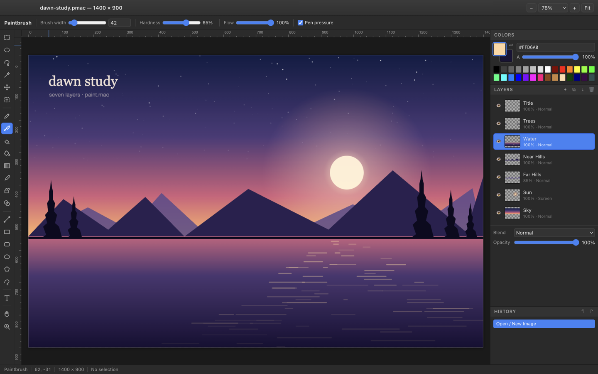
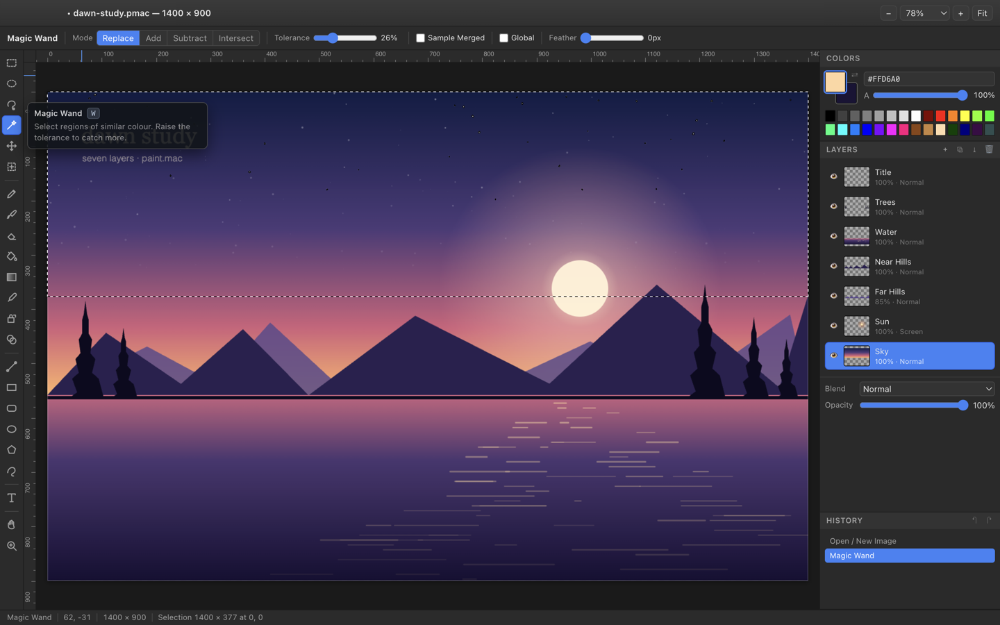
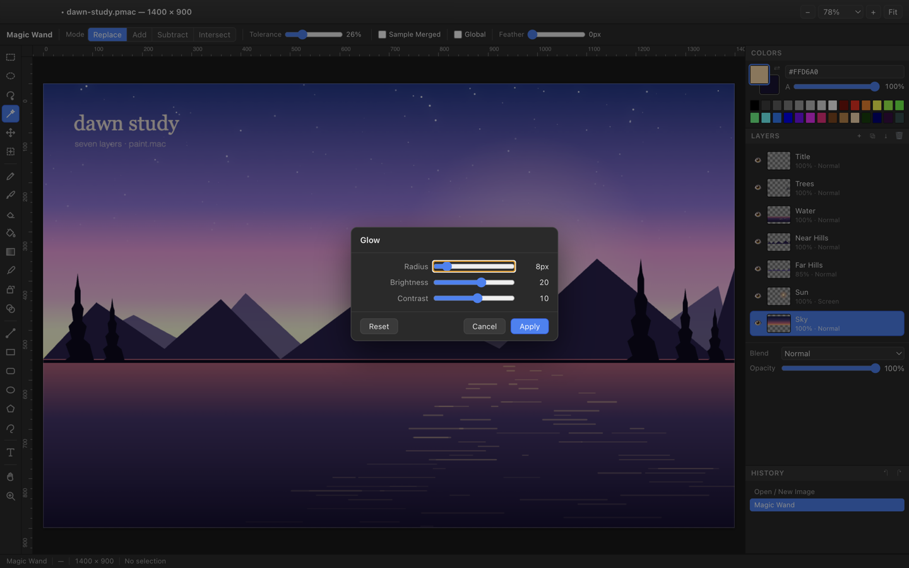
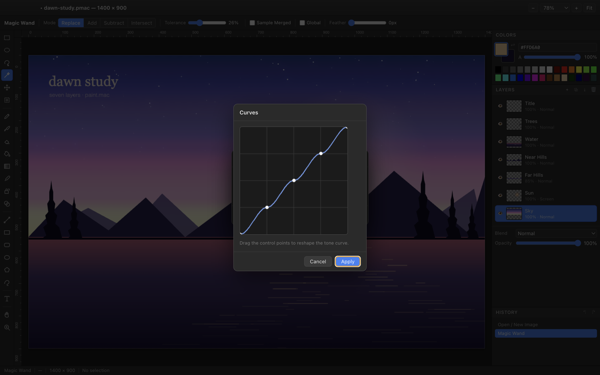
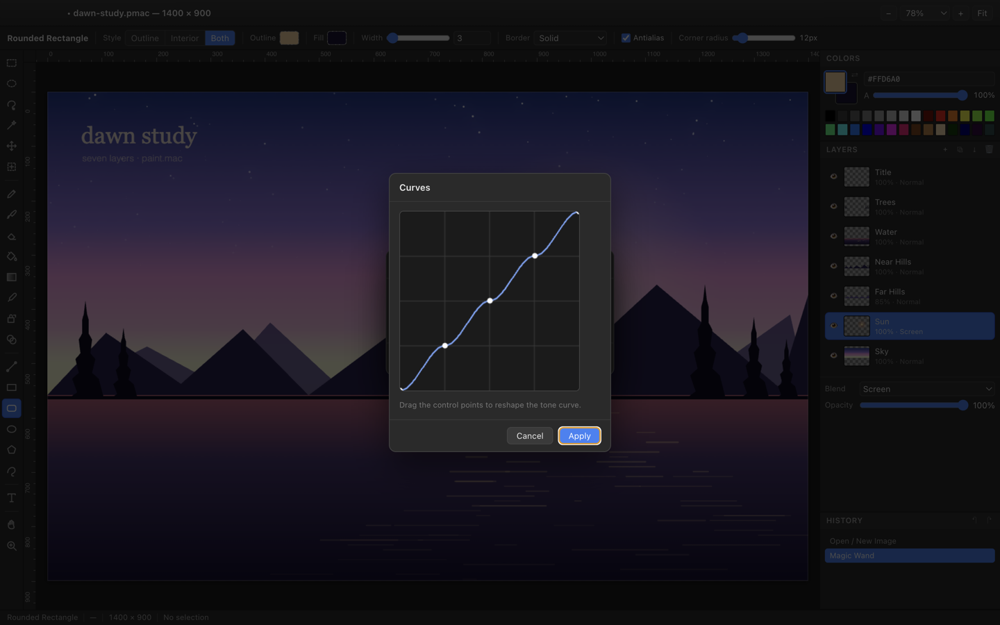

<div align="center">


# Paint.mac

**A fast, layered raster image editor — the Paint.NET toolset, rebuilt for the modern desktop.**

Layers and blend modes · mask-based selections · magic wand · adjustments · effects — all with
live preview and deep undo.




</div>

---

## Highlights

|  |  |
|---|---|
| **Layers** | Unlimited layers with per-layer opacity, visibility and 17 blend modes. Drag to reorder, rename in place, duplicate, merge down, flatten, import an image as a layer, flip or rotate/zoom a single layer. |
| **Selections** | Rectangle, ellipse, lasso and magic wand, each with Replace / Add / Subtract / Intersect and optional feathering. Selections are 8-bit coverage masks, so soft edges survive every operation. Pasted or lifted pixels float above the layer: drag to move them, or drag a handle to scale them (⇧ keeps proportions) before dropping. |
| **Painting** | Pencil, paintbrush (size, hardness, flow, pen pressure), eraser, paint bucket with tolerance and feathering, four gradient types, colour picker, clone stamp and recolour. |
| **Shapes & text** | Line with arrowheads, rectangle, rounded rectangle, ellipse, polygon/star and freeform — each with independent outline and fill colours, five border styles and configurable line ends. Text is typed directly on the canvas. |
| **Adjustments** | Auto level, black & white, invert, sepia, brightness/contrast, hue/saturation, levels with a histogram, curves, posterize and colour temperature. |
| **Effects** | 19 effects across blurs, photo, stylize, noise, distort and render — every one previewing live on the real canvas. |
| **Files** | `.pmac` keeps the full layer stack. Opens PNG, JPEG, WebP, GIF and BMP; exports PNG, JPEG and WebP with a quality setting. |

Plugins are deliberately out of scope.

---

## Screenshots

<table>
<tr>
<td width="50%">

<p align="center"><em>Magic wand with live marching ants and tooltips</em></p>
</td>
<td width="50%">

<p align="center"><em>Effects preview live on the real canvas, not a thumbnail</em></p>
</td>
</tr>
<tr>
<td width="50%">

<p align="center"><em>Curves, levels and a full histogram</em></p>
</td>
<td width="50%">

<p align="center"><em>Layers with blend modes, and per-tool options</em></p>
</td>
</tr>
</table>

---

## Install

Grab the build for your platform from the [Releases page](https://github.com/alroland/paint.mac/releases).

### macOS

| Download | For |
|---|---|
| `Paint.mac-1.0.2-arm64.dmg` | Apple Silicon (M1 and later) |
| `Paint.mac-1.0.2-x64.dmg` | Intel Macs |

Open the disk image and drag **Paint.mac** into Applications.

#### Getting past Gatekeeper

Paint.mac is ad-hoc signed but **not notarised** — there is no Apple Developer certificate behind this
project — so macOS blocks the first launch. Anything you download through a browser also gets a
`com.apple.quarantine` flag, and that flag is what triggers the block. Two ways through it.

**Option 1 — remove the quarantine flag (one command, no prompts).**

Do this *before* opening the disk image and the copied app inherits a clean state:

```bash
xattr -dr com.apple.quarantine ~/Downloads/Paint.mac-1.0.2-arm64.dmg
```

Or, if you have already installed it:

```bash
xattr -dr com.apple.quarantine /Applications/Paint.mac.app
```

`-d` deletes one attribute, `-r` applies it through the whole bundle. It does not touch the code
signature — the app still verifies afterwards. Confirm it worked; **no output means the flag is gone**:

```bash
xattr -p com.apple.quarantine /Applications/Paint.mac.app
# xattr: ...: No such xattr: com.apple.quarantine   ← this is what you want
```

**Option 2 — approve it in System Settings.**

Double-click the app, dismiss the warning, then open **System Settings → Privacy & Security**, scroll
to Security, and click **Open Anyway** next to the Paint.mac message. Right-click → Open no longer
works as a bypass on macOS 15 and later.

> If you instead see **"Paint.mac is damaged and can't be opened"**, you have a build from before
> 1 Sep 2026, when the macOS artifacts carried a broken signature. Download it again.

### Windows

| Download | For |
|---|---|
| `Paint.mac-1.0.2-Setup-x64.exe` | Installer, 64-bit |
| `Paint.mac-1.0.2-Setup-arm64.exe` | Installer, ARM64 |
| `Paint.mac-1.0.2-portable.exe` | No install, runs from anywhere |

The installer is unsigned, so SmartScreen will warn on first run — choose **More info → Run anyway**.

Windows marks downloaded files much as macOS does. If the installer refuses to start, unblock it:
right-click the `.exe` → **Properties** → tick **Unblock** → OK. Or in PowerShell:

```powershell
Unblock-File -Path .\Paint.mac-1.0.2-Setup-x64.exe
```

### Linux

| Download | For |
|---|---|
| `Paint.mac-1.0.2.AppImage` | Any distribution, x86-64 |
| `Paint.mac-1.0.2-arm64.AppImage` | Any distribution, ARM64 |
| `paint-mac_1.0.2_amd64.deb` | Debian, Ubuntu, Mint — x86-64 |
| `paint-mac_1.0.2_arm64.deb` | Debian, Ubuntu, Mint — ARM64 |

Linux has no quarantine flag — an AppImage just needs the executable bit.

```bash
# AppImage — no installation needed
chmod +x Paint.mac-1.0.2.AppImage
./Paint.mac-1.0.2.AppImage

# Debian / Ubuntu
sudo apt install ./paint-mac_1.0.2_amd64.deb
```

No `.rpm` is published yet — building one needs `rpmbuild`, which isn't available on the
machine these releases are cut from. `npm run dist:linux` produces one on a Linux host.

> On some minimal distributions the AppImage needs FUSE:
> `sudo apt install libfuse2` (Debian/Ubuntu) or run it with `--appimage-extract-and-run`.

---

## Build from source

Requires **Node.js 20+**.

```bash
git clone https://github.com/alroland/paint.mac.git
cd paint.mac
npm install
npm start                # run it
```

Packaging uses [electron-builder](https://www.electron.build/):

```bash
npm run dist             # installers for the platform you are on
npm run dist:mac         # .dmg + .zip  (arm64 + x64)
npm run dist:win         # NSIS installer + portable .exe
npm run dist:linux       # AppImage + .deb + .rpm
npm run pack             # unpacked app, no installer — fastest
```

macOS and Linux artifacts cross-build from a Mac. Windows installers additionally need Wine when
built from macOS or Linux; building on Windows needs nothing extra. `.rpm` requires `rpmbuild`.

```bash
npm run icon             # regenerate the app icon from scripts/icon/render.html
npm run screenshots      # regenerate docs/screenshots from a scripted document
npm run perf             # time the interactions that have to stay under a frame budget
```

---

## Keyboard

macOS uses ⌘; Windows and Linux use Ctrl. The in-app list is under **Help → Keyboard Shortcuts** (⌘/).

<details>
<summary><strong>Tools</strong></summary>

| Key | Tool |
|---|---|
| `S` `D` `L` `W` | Rectangle · Ellipse · Lasso · Magic wand select |
| `M` `N` | Move selected pixels · Move selection outline |
| `P` `B` `E` | Pencil · Paintbrush · Eraser |
| `F` `G` `K` | Paint bucket · Gradient · Colour picker |
| `C` `R` `T` | Clone stamp · Recolour · Text |
| `O` `U` `I` `Y` | Line · Rectangle · Ellipse · Polygon |
| `H` `Z` | Pan · Zoom |
| `X` | Swap primary and secondary colours |
| `[` `]` | Decrease · increase brush size |

</details>

<details>
<summary><strong>Editing, view and image</strong></summary>

| Key | Action |
|---|---|
| ⌘Z / ⇧⌘Z | Undo · Redo |
| ⌘X / ⌘C / ⌘V | Cut · Copy · Paste |
| ⇧⌘C / ⇧⌘V | Copy merged · Paste into new layer |
| ⌫ | Erase the selection to transparent |
| ⌥⌫ | Fill the selection with the primary colour |
| ⌘A / ⌘D / ⌘I | Select all · Deselect · Invert selection |
| ⎋ | Cancel the current drag, or deselect when nothing is in progress |
| Space + drag | Pan from any tool |
| ⌘-scroll / pinch | Zoom at the pointer |
| ⌘0 / ⌘B | Actual size · Fit to window |
| ⇧⌘X | Crop to selection |
| ⌘R / ⇧⌘R | Resize image · Canvas size |
| ⌘] / ⌘[ | Rotate 90° clockwise · counter-clockwise |
| ⇧⌘F / ⌘M | Flatten · Merge layer down |

</details>

---

## File formats

| Format | Open | Save | Notes |
|---|:--:|:--:|---|
| `.pmac` | ✅ | ✅ | Native format. Preserves the layer stack, opacity and blend modes. |
| PNG | ✅ | ✅ | Full alpha. |
| JPEG | ✅ | ✅ | Quality slider; transparency is composited over white. |
| WebP | ✅ | ✅ | Quality slider. |
| GIF / BMP | ✅ | — | Opened as a single flattened layer. |

A `.pmac` file is a small binary container: a JSON header followed by one PNG per layer. Any layer
can be recovered with a standard PNG decoder if anything ever goes wrong.

---

## Performance

The app is built to stay smooth on large documents.

- The composite is cached at document resolution and **only the dirty rectangle is recomposed**, so a
  brush dab costs work proportional to the dab — not to the canvas, or the number of layers.
- Drawing that must respect a selection goes through a scratch canvas sized to the dab, rather than
  clipping the whole page.
- Undo snapshots only the 128×128 tiles a stroke actually touches, captured as GPU-side canvas copies
  rather than `getImageData` readbacks.
- The magic wand and paint bucket use a **span-based scanline fill**, so each pixel is tested a
  constant number of times regardless of how wide the matching region is.
- Marching ants merge collinear boundary edges into runs; past a complexity cap the outline switches
  to a cached edge bitmap costing one blit per frame.
- Rendering is demand-driven — an idle window does no work at all.
- In-progress strokes, shape previews and dragged selections ride on a single transient overlay
  composited between layers, so previews are pixel-identical to the committed result.

Measured on a 4000×3000 document: magic wand 7–174 ms across tolerances, selection setup ~40 ms, and
rendering under 1 ms per frame at every zoom level.

---

## Development

```bash
npm run dev              # devtools open, renderer errors mirrored to the terminal
npm test                 # the full suite
```

`npm test` runs three layers of checks:

1. **Static wiring** — every menu item and toolbar button maps to a registered command handler, and
   no handler is unreachable.
2. **Shutdown** — the app is launched four times and must actually exit each time: clean document,
   window-closed-first, after answering the unsaved-changes prompt, and with a renderer that never
   responds.
3. **Behaviour** — 256 assertions driving the real tools and document model: strokes and undo,
   selection clipping, feathered masks, the magic wand and selection translate (both compared against
   brute-force reference implementations, with worst-case timing budgets), layer operations, every
   effect, transforms, the `.pmac` round trip through real IPC, export, history navigation,
   clipboard interchange, marching-ants render cost, tooltips, degenerate inputs, and the UI layout.
   It also sweeps every command, and fails if anything reaches the global error handlers.

The same suite runs inside the packaged app, where assets live in an asar archive:

```bash
npm run pack
./dist/mac-arm64/Paint.mac.app/Contents/MacOS/Paint.mac --selftest --exit-after-tests
```

### Layout

```
build/            Generated app icon (icon.icns / icon.png)
docs/             Screenshots for this README
scripts/          Icon and screenshot generators, static wiring and shutdown checks
src/main/         Electron main process: window, native menus, file and clipboard IPC
src/preload/      Narrow contextBridge surface; the renderer can only read and
                  write paths the user picked in a native dialog
src/renderer/
  js/document.js    Layer stack + dirty-rect composite cache
  js/selection.js   8-bit coverage masks, boolean combining, magic wand, feather
  js/history.js     Undo entries (tile, region, whole-document, selection, metadata)
  js/paint.js       Selection-aware drawing, stroke recording, flood fill, brush tips
  js/view.js        Viewport transform, per-frame draw, rulers
  js/app.js         State owner and input router
  js/commands.js    Every menu / shortcut / button command
  js/tools/         Tool implementations
  js/image/         Adjustments, effects, transforms, live-preview filter sessions
  js/ui/            Panels, dialogs and tooltips
```

The app icon and the README screenshots are both **generated from code** (`npm run icon`,
`npm run screenshots`) so they can be regenerated instead of going stale.

---

## License

**[0BSD](LICENSE)** — the BSD Zero Clause License. Use it, copy it, change it, sell it, ship it in a
closed-source product. No attribution required, no notice to preserve, no conditions of any kind.
The only thing the licence does is disclaim warranty and liability.

### Third-party code

Paint.mac's own source is 0BSD, but the packaged builds bundle Electron, Node.js and Chromium, which
carry their own licences (MIT, BSD-3-Clause and others). Those are permissive and impose no
copyleft, but if you redistribute the built application you should ship the licence notices that
electron-builder places in the app bundle alongside it. Building on top of the **source** carries no
such obligation.

<div align="center">
<sub>Paint.mac — by <strong>Al Roland</strong> · <a href="https://www.alroland.com/paint.mac">www.alroland.com/paint.mac</a></sub>
</div>
